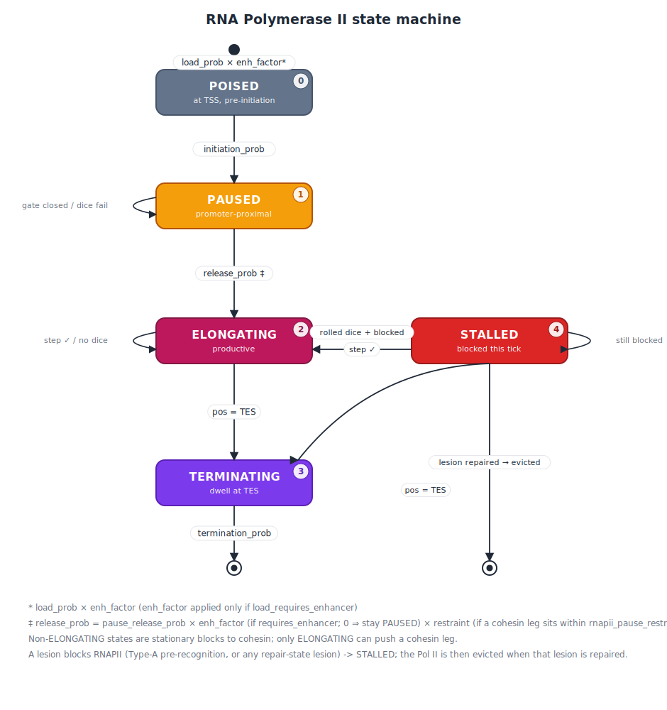
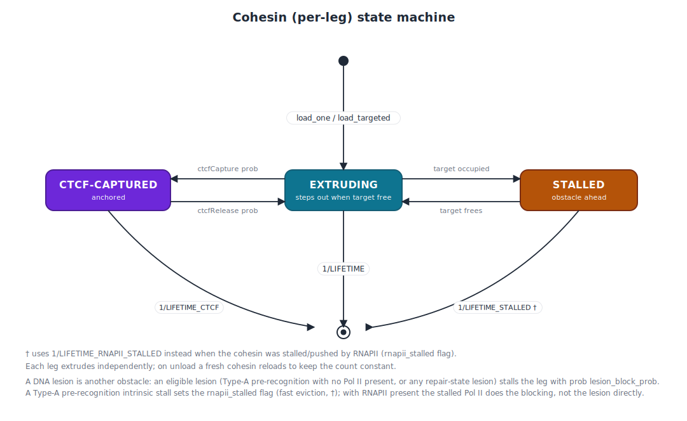
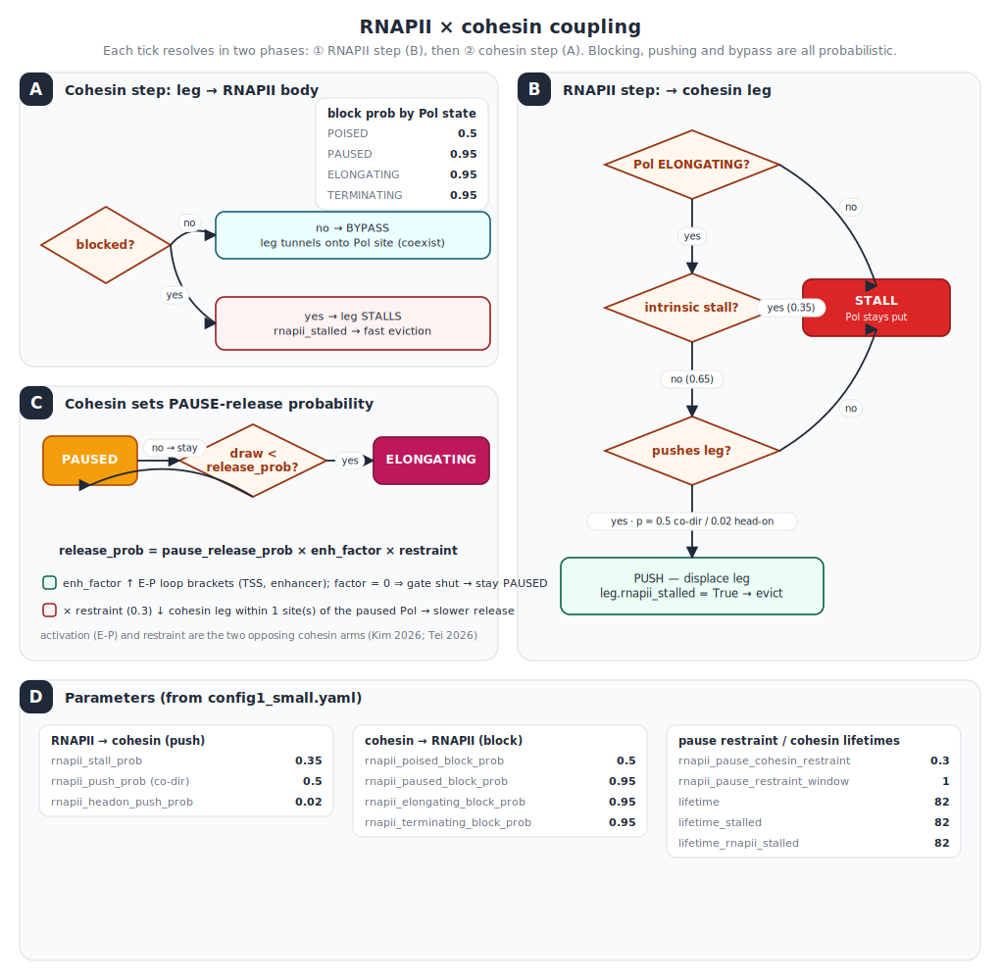

# Loop Extrusion Config Scheme

This document describes the current YAML layout for the modular
loop-extrusion pipeline. It is intentionally schema-oriented: it explains the
sections, fields, plugin hooks, runtime path rules, and common mechanics without
binding the scheme to any one config file, biological condition, or experiment
name.

The source of truth is the typed configuration in
[`../config.py`](../config.py). Stage behavior lives in
[`../lef.py`](../lef.py), [`../viewer.py`](../viewer.py),
[`../polymer.py`](../polymer.py), [`../contacts.py`](../contacts.py),
[`../qc.py`](../qc.py), and [`../compare.py`](../compare.py). Built-in plugin
implementations live under [`../plugins/`](../plugins/).

## Top-Level Layout

A pipeline config is a YAML mapping with these top-level sections:

```yaml
lef:      # 1D cohesin, CTCF, optional RNAPII, optional lesions
viewer:   # standalone interactive HTML derived from the 1D trajectory
polymer:  # 3D OpenMM simulation driven by the LEF trajectory
contacts: # contact-map sampling, normalization, and rendering
```

Every section is optional. Missing sections and missing keys fall back to the
dataclass defaults in `config.py`. An empty YAML file therefore means "run the
whole pipeline with defaults".

The generic shape is:

```yaml
lef:
  chain_length: <sites per chain>
  num_chains: <number of independent chains/replicates>
  separation: <average sites per cohesin>
  lifetime: <cohesin lifetime in 1D ticks>
  lifetime_stalled: <lifetime when stalled by non-CTCF obstacles>
  lifetime_ctcf: <optional; lifetime when captured at a CTCF site (defaults to lifetime)>
  warmup_steps: <discarded 1D ticks before recording>
  trajectory_length: <recorded 1D ticks>
  chunk_size: <number of HDF5 write chunks>
  seed: <integer or null>
  max_rnapii: <recorded RNAPII slots, when RNAPII is enabled>
  topology_kwargs:
    <kwargs for selected topology plugin>
  plugins:
    topology: <PluginSpec>
    load: <PluginSpec>
    unload_prob: <PluginSpec>
    capture: <PluginSpec>
    release: <PluginSpec>
    translocate: <PluginSpec>
    rnapii_load: <PluginSpec or null>
    rnapii_translocate: <PluginSpec or null>
    lesion: <PluginSpec or null>

viewer:
  stride: <frame stride before decimation>
  max_frames: <maximum frames embedded in HTML; 0 means no max>
  bridge_cost: <shortest-path cost of one cohesin chord>
  insulation_score_window: <window in lattice sites>
  site_start: <first displayed site or null>
  site_end: <exclusive last displayed site or null>
  ep_pairs:
    - {e: <enhancer site>, p: <promoter site>, label: <optional label>}

polymer:
  platform: cuda
  gpu: "0"
  integrator: variableLangevin
  density: <density used for box sizing>
  pbc: <true for periodic cube, false for force-builder confinement>
  md_steps_per_block: <OpenMM steps per LEF frame>
  save_every_blocks: <save one conformation every N LEF frames>
  restart_every_blocks: <dynamic-bond rebuild interval in LEF frames>
  plugins:
    force_builder:
      target: <callable>
      kwargs:
        <kwargs for selected force builder>
    initial_conformation: <PluginSpec>

contacts:
  map_starts: [<window starts>]
  replicate_map_starts_across_chains: <true/false>
  map_size: <square map size>
  cutoff: <3D distance cutoff, or list of cutoffs e.g. [2, 3, 4, 5, 6]>
  num_processes: <CPU workers>
  plugins:
    sampler: <PluginSpec>
    obs_over_exp: <PluginSpec or null>
    post_process: <PluginSpec or null>
    viz: <PluginSpec or null>
```

Values are in pipeline units. A lattice site in `lef` corresponds to one
polymer monomer in `polymer` and one pixel/bin unit before any contact-map
coarsening. If a config interprets one site as one kilobase, that is a modeling
choice made by that config, not a separate schema field.

## Loading Rules

`load_config(path)` reads YAML into nested dataclasses:

| Situation | Behavior |
| --- | --- |
| Unknown dataclass key | Hard error: `KeyError: Unknown config key '<key>' for <Class>`. |
| Missing key or section | Dataclass default is used. |
| Empty YAML file | Equivalent to all defaults. |
| Required plugin set to `null` | Error, because `PluginSpec` is required. |
| Optional plugin set to `null` | The optional step is skipped. |
| `topology_kwargs` or plugin `kwargs` | Stored as plain dictionaries and passed to the selected callable. |

The loader validates the fixed schema keys, not the contents of arbitrary
`kwargs` dictionaries. If a kwarg does not match the callable selected by a
plugin, the error is raised when that stage calls the plugin.

## Runtime Paths

Path fields exist in the dataclasses, but the CLI is usually run with an output
directory:

```bash
python -m polychrom.pipelines.loop_extrusion.cli <stage> config.yaml output_dir
```

When `output_dir` is supplied, all stage input/output paths are derived from
that one directory:

| Field | Runtime value |
| --- | --- |
| `lef.output_path` | `output_dir/LEFPositions.h5` |
| `viewer.lef_positions_path` | `output_dir/LEFPositions.h5` |
| `viewer.output_path` | `output_dir/bridging_viewer.html` |
| `viewer.heatmap_output_path` | `output_dir/bridging_viewer_visited_heatmap.npy` |
| `viewer.elements_output_path` | `output_dir/bridging_viewer_elements.json` |
| `polymer.lef_positions_path` | `output_dir/LEFPositions.h5` |
| `polymer.output_folder` | `output_dir` |
| `contacts.trajectory_folder` | `output_dir` |
| `contacts.raw_output_path` | `output_dir/contact_map.npy` |
| `contacts.oe_output_path` | `output_dir/contact_map_oe.npy` |
| `contacts.viz_output_path` | `output_dir/contact_map_oe.png` |

The CLI also copies the input config into `output_dir` before running. Prefer
the runtime `output_dir` argument for run location, and use YAML path fields
only when a stage must read or write nonstandard files.

## CLI Stages

```bash
python -m polychrom.pipelines.loop_extrusion.cli lef      config.yaml [output_dir]
python -m polychrom.pipelines.loop_extrusion.cli viewer   config.yaml [output_dir]
python -m polychrom.pipelines.loop_extrusion.cli polymer  config.yaml [output_dir]
python -m polychrom.pipelines.loop_extrusion.cli contacts config.yaml [output_dir]
python -m polychrom.pipelines.loop_extrusion.cli qc       config.yaml [output_dir]
python -m polychrom.pipelines.loop_extrusion.cli all      config.yaml [output_dir]
python -m polychrom.pipelines.loop_extrusion.cli compare  cfgA.yaml cfgB.yaml [options]
```

`all` runs:

```text
lef -> viewer -> polymer -> contacts -> qc
```

The viewer runs before the 3D stage so the 1D dynamics can be inspected before
OpenMM work. The `viewer` stage can generate `LEFPositions.h5` itself if it is
missing. The `polymer`, `contacts`, and `qc` stages require their upstream
outputs to already exist unless they are run through `all`.

The `compare` command is not configured by a top-level YAML section. It loads
two normal pipeline configs, optionally overrides their run folders, and writes
pairwise metrics and plots into a comparison directory.

## PluginSpec

Every pluggable mechanism is a `PluginSpec`: a callable target plus optional
keyword arguments.

Short form:

```yaml
load: polychrom.pipelines.loop_extrusion.plugins.lef_dynamics:load_one
```

Long form:

```yaml
force_builder:
  target: polychrom.pipelines.loop_extrusion.plugins.forces:paper_force_builder
  kwargs:
    repulsion_energy: 50.0
```

Targets use `module:attribute` form. `module.attribute` is accepted too, but
`module:attribute` is clearer because module paths and function names are
separated unambiguously.

Optional plugin slots may be `null`:

```yaml
contacts:
  plugins:
    obs_over_exp: null  # write only the raw contact map
    viz: null           # skip PNG rendering
```

Plugin kwargs are always passed at call time. Use kwargs that belong to the
selected plugin implementation.

## Pipeline Data Flow

```text
YAML config
  |
  v
1D LEF stage
  output: LEFPositions.h5
    - positions: recorded cohesin leg pairs
    - optional rnapii_positions / rnapii_states
    - optional lesions
    - attributes describing lattice size and enabled features
  |
  v
viewer stage
  output: bridging_viewer.html
  output: bridging_viewer_visited_heatmap.npy
  output: bridging_viewer_elements.json
  |
  v
3D polymer stage
  input: LEFPositions.h5
  output: HDF5 trajectory block files
  |
  v
contacts stage
  input: 3D trajectory block files
  output: contact_map.npy
  output: optional contact_map_oe.npy
  output: optional contact_map_oe.png
  |
  v
qc stage
  input: LEFPositions.h5 and optional contact_map.npy / contact_map_oe.npy
  output: qc/metrics.json
  output: qc/report.md
  output: qc/plots/*.png
```

## `lef` Section

The `lef` section controls the 1D lattice simulation.

### Fields

| Field | Default | Description |
| --- | ---: | --- |
| `chain_length` | `4000` | Number of lattice sites per chain. |
| `num_chains` | `10` | Number of chains. Many configs use this as independent replicate chains. |
| `separation` | `800` | Average sites per cohesin; `num_lefs = chain_length * num_chains // separation`. |
| `lifetime` | `200` | Average cohesin lifetime in 1D ticks. |
| `lifetime_stalled` | `200` | Lifetime used when a cohesin is stalled by a non-CTCF obstacle. |
| `lifetime_ctcf` | `null` | Lifetime used while a cohesin is captured at a CTCF site. Models WAPL-protected boundary-stabilized residence (Wutz 2017; Haarhuis 2017). `null` falls back to `lifetime`. Larger = longer docked dwell = stronger corner/anchor accumulation. |
| `warmup_steps` | `0` | 1D ticks to run before recording; discarded from output. |
| `trajectory_length` | `100000` | Number of recorded 1D frames. This also drives the number of LEF frames available to OpenMM. |
| `chunk_size` | `50` | Number of HDF5 write chunks used while recording `positions`. |
| `output_path` | `trajectory/LEFPositions.h5` | Written HDF5 path; overridden by CLI `output_dir`. |
| `seed` | `null` | Optional NumPy RNG seed for reproducible 1D dynamics. |
| `topology_kwargs` | `{}` | Keyword arguments passed to `lef.plugins.topology`. |
| `max_rnapii` | `64` | RNAPII slots recorded per frame **per chain**; the dataset is padded to `max_rnapii * num_chains`. **Must exceed the live Pol II count.** `load_rnapii` is uncapped, so if the live list exceeds `max_rnapii * num_chains`, recording keeps only the oldest Pols (`rnapiis[:cap]`) — freshly-loaded `POISED`/`PAUSED` Pols (appended last) are truncated and the metrics read ~0% paused / 0% poised. This caps only the recording, not the dynamics. |
| `plugins` | default `LEFPlugins` | Plugin slots for topology and 1D mechanics. |

`chain_length * num_chains` is the total lattice size. Cohesin count is derived
by integer division; it is not configured directly.

### Default LEF Plugins

| Slot | Default | Purpose |
| --- | --- | --- |
| `topology` | `plugins.topology:uniform_tad_topology` | Builds the CTCF layout and any extra 1D bookkeeping. |
| `load` | `plugins.lef_dynamics:load_one` | Loads one cohesin on adjacent free sites. |
| `unload_prob` | `plugins.lef_dynamics:unload_prob` | Computes per-tick unload probability for one cohesin: `1/LIFETIME_CTCF` if captured at CTCF, else `1/LIFETIME_RNAPII_STALLED` if RNAPII-stalled, else `1/LIFETIME_STALLED` if otherwise stalled, else `1/LIFETIME`. |
| `capture` | `plugins.lef_dynamics:capture` | Captures cohesin legs at CTCF sites. |
| `release` | `plugins.lef_dynamics:release` | Releases captured CTCF legs. |
| `translocate` | `plugins.lef_dynamics:translocate` | Advances cohesin dynamics one tick. |
| `rnapii_load` | `null` | Optional RNAPII loading step. |
| `rnapii_translocate` | `null` | Optional RNAPII state/translocation step. |
| `lesion` | `null` | Optional lesion update step. |

RNAPII dynamics are enabled only when both `rnapii_load` and
`rnapii_translocate` are non-null. Lesion dynamics are enabled when `lesion` is
non-null. These feature flags control which extra HDF5 datasets are written.

### Topology Plugins

A topology plugin is called as:

```python
topology_fn(lef_cfg, **lef_cfg.topology_kwargs)
```

It returns an `args` dictionary consumed by load, capture, release,
translocation, RNAPII, and lesion plugins. All built-in topology plugins create
the base fields:

```text
N
chain_length
num_chains
LIFETIME
LIFETIME_STALLED
LIFETIME_CTCF
ctcfCapture
ctcfRelease
```

Built-in topology choices:

| Plugin | Main kwargs | Description |
| --- | --- | --- |
| `uniform_tad_topology` | `tad_positions`, `capture_prob`, `release_prob`, `symmetric` | Repeats the same CTCF positions on each chain. With `symmetric: true`, each CTCF can capture both leg directions. |
| `convergent_tad_topology` | `tad_positions`, `boundary_strength`, `release_prob`, `include_chromosome_ends`, `default_boundary_strength` | Splits each chain at TAD boundaries and places inward-facing barriers on interval edges. `boundary_strength` is a scalar (uniform) or a `{position: strength}` mapping; positions missing from the mapping use `default_boundary_strength` (`0.5`). |
| `gene_aware_topology` | uniform TAD kwargs plus `genes`, RNAPII, loading, and lesion kwargs | Uniform/symmetric CTCF layout plus gene/RNAPII/lesion bookkeeping. |
| `gene_aware_convergent_tad_topology` | convergent TAD kwargs plus `genes`, RNAPII, loading, and lesion kwargs | Directional CTCF layout plus gene/RNAPII/lesion bookkeeping. |
| `ep_pair_topology` | `n_pairs`, `ep_distance`, `pair_spacing`, `first_pair_offset`, `boundary_strength`, `convergent_orientation` | Programmatically places enhancer-promoter pairs and flanking CTCF barriers. |
| `explicit_ctcf_topology` | `left_capture`, `right_capture`, `left_release`, `right_release` | Uses user-supplied CTCF dictionaries directly. |

`tad_positions` are interior boundaries in chain-relative coordinates for the
TAD topology plugins. Boundaries are applied to every chain by adding
`chain_idx * chain_length`.

Directional convention:

```text
left-moving cohesin leg  = side -1
right-moving cohesin leg = side +1
```

In a convergent TAD interval, the left interval edge captures the left-moving
leg and the right interval edge captures the right-moving leg, so a cohesin
loaded inside the interval can become bracketed by inward-facing CTCF sites.

### Gene-Aware Topology

The `gene_aware_*` topology plugins add transcription units and optional
targeted loading / lesion state. Gene IDs are assigned from list order after any
replication across chains. A `gene_id` key in YAML is not required by the
builder.

Per-gene fields:

| Field | Required | Default | Description |
| --- | --- | --- | --- |
| `tss` | yes | none | Transcription start site and RNAPII loading site. |
| `tes` | yes | none | Transcription end site. `tes > tss` gives direction `+1`; `tes < tss` gives `-1`. |
| `load_prob` | no | `rnapii_default_load_prob` | Per-tick probability of loading one POISED RNAPII onto a free TSS. |
| `enhancer_pos` | no | `null` | Single cognate enhancer site (legacy form) used for E-P contact tests and targeted loading. Mirrors the first entry of `enhancers`. |
| `enhancers` | no | `()` | List of enhancer sites regulating this gene (shadow / super-enhancer). When given it wins over `enhancer_pos`; `enhancer_pos` is set to the first entry for back-compat. |
| `enhancer_logic` | no | `"additive"` | How simultaneous E-P contacts combine into transcriptional output: `any` (redundancy, one contact suffices), `all` (every enhancer must contact), `additive` (output scales with #contacts), `synergistic` (super-additive, `#contacts ** enhancer_synergy`). Single-enhancer genes behave identically (0/1) regardless of value. |
| `enhancer_synergy` | no | `1.5` | Exponent applied to the contact count, used only when `enhancer_logic: synergistic`. |
| `requires_enhancer` | no | `false` | If true, PAUSED to ELONGATING transition requires current E-P contact. |
| `load_requires_enhancer` | no | `false` | If true, RNAPII recruitment to the TSS also requires current E-P contact. |
| `initiation_prob` | no | `1.0` | POISED to PAUSED probability per tick. |
| `pause_release_prob` | no | `1.0` | PAUSED to ELONGATING probability per eligible tick. |
| `elongation_step_prob` | no | `1.0` | Probability an ELONGATING RNAPII advances one site per tick. |
| `pause_offset` | no | `0` | Optional promoter-proximal pause offset from the TSS. |
| `termination_prob` | no | `1.0` | TERMINATING unload probability per tick after reaching TES. |

Common `gene_aware_*` kwargs:

| Kwarg | Default | Description |
| --- | ---: | --- |
| `genes` | `null` | List of gene dictionaries. |
| `replicate_genes_across_chains` | `false` | Treat gene coordinates as chain-relative and copy them to each chain. |
| `rnapii_default_load_prob` | `0.02` | Default gene `load_prob`. |
| `rnapii_stride` | `1` | Step count for the legacy single-state RNAPII translocator. |
| `lifetime_rnapii_stalled` | `lifetime_stalled` | Cohesin residence (1D ticks) used **only** when a cohesin is stalled or pushed *by RNAPII* (the `rnapii_stalled` flag), modeling active Pol II eviction of cohesin (Busslinger 2017; Jeppsson 2022). Kept separate from generic `lifetime_stalled` so depleting RNAPII restores residence only where transcription caused eviction (the config1-vs-config2 loop-shortening mechanism). Smaller = faster eviction = shorter loops in gene bodies. |
| `rnapii_stall_prob` | `0.4` | Intrinsic probability that elongating RNAPII stalls on a cohesin obstacle. |
| `rnapii_push_prob` | `0.3` | Probability that an elongating RNAPII pushes a co-directional cohesin leg. |
| `rnapii_headon_push_prob` | `0.0` | Probability that an elongating RNAPII pushes a head-on cohesin leg. |
| `rnapii_pause_cohesin_restraint` | `1.0` | Cohesin gatekeeper (Tei et al. 2026): multiplier (`<1`) applied to a PAUSED RNAPII's release probability when a cohesin leg sits within `rnapii_pause_restraint_window` sites, modeling cohesin delaying pause release. `1.0` disables it (no restraint). |
| `rnapii_pause_restraint_window` | `1` | Site radius for detecting a cohesin leg adjacent to a paused RNAPII; only consulted when `rnapii_pause_cohesin_restraint < 1.0`. |
| `rnapii_poised_block_prob` | `1.0` | Probability that POISED RNAPII blocks an incoming cohesin leg. |
| `rnapii_paused_block_prob` | `rnapii_block_prob` | Probability that PAUSED RNAPII blocks an incoming cohesin leg. |
| `rnapii_elongating_block_prob` | `rnapii_block_prob` | Probability that ELONGATING RNAPII blocks an incoming cohesin leg. |
| `rnapii_terminating_block_prob` | paused block probability | Probability that TERMINATING RNAPII blocks an incoming cohesin leg. |
| `rnapii_block_prob` | `1.0` | Backward-compatible fallback for state-specific block probabilities. |
| `ep_contact_tolerance` | `2` | Slack in the cohesin-loop E-P containment test. |
| `targeted_load_prob` | `0.0` | Probability that `load_targeted` loads at a gene-derived loading site. |
| `loading_window` | `2` | Search window around a targeted loading site. |
| `target_enhancers` | `true` | Include enhancer sites as targeted loading sites. |
| `target_tss` | `true` | Include TSS sites as targeted loading sites. |
| `lesion_prob` | `0.0` | Per-gene, per-tick stochastic lesion occurrence probability. |
| `lesion_lifetime` | `100` | Lesion countdown before repair. |
| `lesion_block_prob` | `0.95` | Probability that a lesion blocks an incoming cohesin leg. |
| `lesion_max` | `64` | Maximum simultaneous lesion sites **per chain** (total cap `lesion_max * num_chains`); also sets recording width. |
| `lesion_spacing` | `0` | If positive, seed periodic lesions in gene bodies at topology creation. |

### RNAPII Dynamics

To drive RNAPII, set both RNAPII plugin slots and use a gene-aware topology:

```yaml
lef:
  plugins:
    topology: polychrom.pipelines.loop_extrusion.plugins.topology:gene_aware_convergent_tad_topology
    translocate: polychrom.pipelines.loop_extrusion.plugins.lef_dynamics:translocate_with_rnapii
    rnapii_load: polychrom.pipelines.loop_extrusion.plugins.rnapii:load_rnapii
    rnapii_translocate: polychrom.pipelines.loop_extrusion.plugins.rnapii:stateful_translocate_rnapii
```

`stateful_translocate_rnapii` uses five states (code in `attrs["state"]` / the
`rnapii_states` dataset):

| State | Code | Meaning |
| --- | --- | --- |
| `POISED` | 0 | Loaded at TSS, not yet initiated. |
| `PAUSED` | 1 | Initiated but promoter-proximal paused (regulatory, near TSS). |
| `ELONGATING` | 2 | Productive one-site-at-a-time transcription. |
| `TERMINATING` | 3 | Reached TES and may dwell before unloading. |
| `STALLED` | 4 | In the gene body, attempted a step but physically blocked this tick (cohesin / traffic / lesion). NOT promoter-proximal pause and NOT productive elongation. |

`STALLED` exists so obstacle stalls do not masquerade as productive
`ELONGATING` ticks (which would dilute the `%paused` metric toward zero on
busy genes). A Pol that rolls its speed dice and is blocked → `STALLED`; one
that does not roll the dice → stays `ELONGATING` (slow but productive). Like
`POISED` / `PAUSED` / `TERMINATING`, a `STALLED` Pol is a stationary block to
cohesin (only `ELONGATING` can push), and it blocks cohesin at the elongating
rate.

E-P contact during the 1D stage is a loop-containment proxy. Each of a gene's
`enhancers` is considered in contact when at least one cohesin loop brackets
that enhancer and the promoter (TSS), with `ep_contact_tolerance` sites of
slack. The per-gene contact *count* (how many enhancers are bracketed) drives an
output multiplier via `enhancer_logic` / `enhancer_synergy`; for a single-enhancer
gene this collapses to the old 0/1 behaviour. The resulting factor is used for
`requires_enhancer` and `load_requires_enhancer`.

Cohesin plays two opposing roles on transcription, both representable here:

* **Activation (E-P arm).** A cohesin loop bracketing the enhancer and promoter
  satisfies `requires_enhancer` / `load_requires_enhancer`, enabling pause
  release and/or loading. Distal (long-range) genes therefore depend on cohesin
  loops, while short-range / constitutive genes (`requires_enhancer: false`) do
  not — mirroring the cohesin-dependent vs cohesin-independent loop classes of
  Kim et al. 2026.
* **Restraint (gatekeeper arm).** When `rnapii_pause_cohesin_restraint < 1.0`, a
  cohesin leg physically within `rnapii_pause_restraint_window` sites of a PAUSED
  RNAPII multiplies that gene's release probability by the restraint factor,
  delaying pause release (Tei et al. 2026). On cohesin loss the restraint is
  relieved (faster release), which partially compensates for lost recruitment.

The restraint is evaluated inside `stateful_translocate_rnapii` after the E-P
gate; with the default `1.0` it is a no-op, so configs that do not set it behave
exactly as before.

#### State Machine Diagrams

**RNAPII** (`stateful_translocate_rnapii`). Edge labels are the per-tick
transition probabilities / conditions.



**Cohesin** (per leg, `translocate` / `translocate_with_rnapii`). Each leg
extrudes outward (`dir = ±1`); the cohesin unloads and a fresh one reloads to
keep the count constant.



**RNAPII × cohesin** collision resolution. Two encounter directions plus the
pause-release coupling.



Figures are generated by [`scripts/make_state_diagrams.py`](scripts/make_state_diagrams.py)
(pure stdlib, no Mermaid). Pass a config to bake its actual parameter values into
the interaction figure (panel D lists them); omit it for symbolic labels:

```bash
python scripts/make_state_diagrams.py configs/config1_small.yaml
```

Re-run after changing the state machine or the mechanic probabilities.

`translocate_with_rnapii` is also the built-in translocator that knows about
lesion barriers. It can be used even when RNAPII plugin slots are `null`, as
long as the selected topology supplies the needed gene/lesion bookkeeping.

### Targeted Cohesin Loading

`load_targeted` biases cohesin loading toward `args["loading_sites"]`, which
the gene-aware topology can populate from enhancer and/or TSS coordinates.

```yaml
lef:
  plugins:
    load: polychrom.pipelines.loop_extrusion.plugins.lef_dynamics:load_targeted
  topology_kwargs:
    targeted_load_prob: <0.0 to 1.0>
    loading_window: <sites around target>
    target_enhancers: true
    target_tss: true
```

With probability `targeted_load_prob`, a new cohesin is placed on a free
adjacent pair near a loading site. If no local slot is free, or if the
probability draw fails, loading falls back to uniform `load_one`. Loading is
kept inside the target site's chain.

### Lesion Dynamics

To update and record lesions, set the lesion plugin:

```yaml
lef:
  plugins:
    lesion: polychrom.pipelines.loop_extrusion.plugins.lesions:update_lesions
```

The gene-aware topology supplies lesion parameters and initializes
`args["lesions"]`. Lesions are damaged lattice sites in gene bodies. They can be
stochastic (`lesion_prob`) or seeded at regular gene-body spacing
(`lesion_spacing`). The update step repairs existing lesions by decrementing
their lifetime, then may add new lesions.

Built-in collision behavior:

* RNAPII cannot step onto a lesion and stalls upstream.
* `translocate_with_rnapii` lets a lesion block an incoming cohesin leg with
  probability `lesion_block_prob`.
* The default `translocate` plugin does not check lesion state.

## `viewer` Section

The viewer stage builds a self-contained HTML page for the 1D trajectory with a similar layout to Földes et. al 2026, as well as insulation scores computed in 1D. It
also writes a cumulative bridge-contact heatmap and a JSON annotation export.

### Fields

| Field | Default | Description |
| --- | ---: | --- |
| `lef_positions_path` | `trajectory/LEFPositions.h5` | Input 1D trajectory; overridden by CLI `output_dir`. |
| `output_path` | `trajectory/bridging_viewer.html` | HTML output path; overridden by CLI `output_dir`. |
| `heatmap_output_path` | `null` | Optional explicit `.npy` export path. If null, derived from HTML stem. |
| `elements_output_path` | `null` | Optional explicit `.json` annotation export path. If null, derived from HTML stem. |
| `stride` | `1` | Keep every Nth frame before `max_frames` decimation. |
| `max_frames` | `1000` | Maximum frames embedded in the HTML; `0` means no maximum. |
| `bridge_cost` | `1.0` | Graph cost of a cohesin chord for effective E-P distance. |
| `insulation_score_window` | `50` | Window in lattice sites for dynamic insulation traces. |
| `site_start` | `null` | First displayed absolute lattice site. |
| `site_end` | `null` | Exclusive last displayed absolute lattice site. |
| `kymo_max_rows` | `1200` | ViewerConfig render-quality field retained for kymograph/background generation. |
| `dpi` | `110` | ViewerConfig render-quality field retained for static image generation. |
| `ep_pairs` | `[]` | Explicit E-P pairs used only when topology supplies no gene annotation. |

The viewer re-derives CTCF, gene, enhancer, and TAD annotations from the `lef`
topology and `topology_kwargs`. Coordinates in exported JSON are display-window
relative, with `siteOffset` giving the absolute offset.

Effective E-P distance is the shortest path on a graph whose backbone edges
have cost equal to genomic separation and whose cohesin loops add shortcut
chords of cost `bridge_cost`.

The viewer has no plugin section.

## `polymer` Section

The polymer stage reads `LEFPositions.h5`, converts each frame's cohesin pairs
into temporary harmonic bonds, and runs OpenMM molecular dynamics.

### Fields

| Field | Default | Description |
| --- | ---: | --- |
| `lef_positions_path` | `trajectory/LEFPositions.h5` | Input 1D trajectory path; overridden by CLI `output_dir`. |
| `output_folder` | `trajectory` | Output folder for HDF5 trajectory blocks; overridden by CLI `output_dir`. |
| `platform` | `cuda` | OpenMM platform name. |
| `gpu` | `"0"` | CUDA GPU selector passed as `GPU`. |
| `integrator` | `variableLangevin` | OpenMM integrator. `variableLangevin` adapts its timestep to keep per-step error under `error_tol`; fixed-step integrators (e.g. `langevin`) ignore `error_tol`. Langevin integrators couple the polymer to a heat bath, so dynamics are Brownian/overdamped rather than ballistic. |
| `error_tol` | `0.01` | Local integration error target for variable-step integrators. Smaller is more accurate but takes more substeps per block (slower); larger risks instability/blowups. Ignored by fixed-step integrators. |
| `collision_rate` | `0.03` | Langevin friction/collision coefficient (inverse time units). High values give strongly damped, diffusive motion and stable but slow conformational sampling; low values give near-ballistic motion that explores faster but can be unstable. |
| `precision` | `mixed` | CUDA precision mode (`single`, `mixed`, `double`). `mixed` is the usual speed/accuracy trade-off on GPU. |
| `seed` | `null` | Optional NumPy/OpenMM seed. The OpenMM integrator seed is offset by the restart-chunk iteration index so each chunk has independent thermal noise while staying reproducible. |
| `density` | `0.1` | Monomer number density (monomers per unit volume) used to size the initial growth box and, when `pbc: true`, the periodic cube. Sets crowding of the initial conformation; the simulated steady-state density is set by whatever confinement the force builder adds. |
| `pbc` | `true` | If true, run in a periodic cubic box sized from `density`. Set false when the force builder supplies its own confinement (e.g. a spherical wall); otherwise the polymer is unbounded. |
| `md_steps_per_block` | `750` | OpenMM integrator steps advanced per LEF frame (one "block"). More steps per block let the polymer relax further toward equilibrium between cohesin moves; fewer steps keep cohesin translocation fast relative to polymer relaxation. |
| `save_every_blocks` | `10` | Save one 3D conformation every N LEF frames. Controls trajectory sampling density on disk. |
| `restart_every_blocks` | `100` | LEF frames per dynamic-bond rebuild chunk. The updater pre-builds all SMC bonds needed in the chunk, then toggles them; larger chunks mean fewer context rebuilds but more inactive bonds resident in the OpenMM context. |
| `initial_relaxation_steps` | `0` | Bare-polymer dynamics (no SMC bonds) run once at the start, after an energy minimization, to relax the artificial initial conformation before loop extrusion begins. |
| `pre_recording_steps` | `0` | Dynamics run with SMC bonds active but before the first recorded block, to let loops equilibrate so early frames are not transient. |
| `smc_bond_wiggle` | `0.2` | Wiggle distance of the harmonic bond representing a captured cohesin loop; bond energy = 1 kT at this extension. Smaller = stiffer loop anchor (tighter chord), larger = looser. Bond stiffness is `kbondScalingFactor / wiggle^2`. |
| `smc_bond_dist` | `0.5` | Rest length of the SMC loop bond in simulation length units. Sets the spatial separation enforced between the two cohesin-anchored monomers. |
| `max_data_length` | `100` | Maximum saved conformations per HDF5 block file. |
| `overwrite` | `true` | Whether the reporter may overwrite existing trajectory output. |
| `plugins` | default `PolymerPlugins` | Force builder and initial conformation hooks. |

Hard requirements:

* `trajectory_length` in the LEF HDF5 must be a multiple of
  `restart_every_blocks`.
* `restart_every_blocks` must be a multiple of `save_every_blocks`.

The dynamic bond updater looks ahead within each restart chunk, creates every
SMC bond needed in that chunk, and then toggles those bonds active/inactive by
changing force parameters in the OpenMM context.

`md_steps_per_block`, `save_every_blocks`, and the integrator settings define
the 3D clock in reduced units. To convert MD steps or blocks into seconds, see
[Mapping Simulation Time to Real Time](#mapping-simulation-time-to-real-time).

### Polymer Plugins

| Slot | Default | Purpose |
| --- | --- | --- |
| `force_builder` | `plugins.forces:default_force_builder` | Adds backbone, angle, nonbonded, confinement, and other forces to the simulation. |
| `initial_conformation` | `plugins.forces:grow_cubic_conformation` | Creates initial `(N, 3)` coordinates from `num_sites` and `box`. |

`force_builder` is called as:

```python
force_builder(sim, num_chains=num_chains, chain_length=chain_length, **kwargs)
```

`initial_conformation` is called as:

```python
initial_conformation(num_sites=n_sites, box=box, **kwargs)
```

### Built-In Force Builders

`default_force_builder` builds separate linear chains with harmonic backbone
bonds, angle force, and polynomial repulsion. It has no attraction terms and no
confinement, so it is the right baseline for a phantom/repulsive chain or for
use with `pbc: true`.

Common kwargs:

| Kwarg | Default | Description |
| --- | ---: | --- |
| `bond_length` | `1.0` | Backbone bond rest length (monomer spacing along the chain). |
| `bond_wiggle` | `0.1` | Backbone bond flexibility: bond energy = 1 kT at this extension, so stiffness scales as `1/wiggle^2`. Smaller = stiffer, more inextensible backbone. |
| `angle_k` | `1.5` | Bending stiffness of the three-monomer angle term; potential is `0.5 * k * angle^2` kT about a straight (`pi`) rest angle. Higher `k` raises persistence length (stiffer chain). |
| `repulsive_trunc` | `1.5` | Energy (in kT) of the polynomial repulsion at full overlap (`r=0`). This is a *soft* core: finite at contact, so chains can pass through each other at finite cost. Higher = harder to cross (more topologically constrained). |
| `repulsive_radius_mult` | `1.05` | Repulsion range as a multiple of the unit contact length; the potential reaches zero at this radius. |
| `restrict_nonbonded_to_chains` | `false` | Restrict nonbonded interactions to pairs within the same chain (via per-chain interaction groups). Use for replicate chains that must not see each other. |

`paper_force_builder` builds linear chains with harmonic backbone bonds, optional
angle force, selective soft-core nonbonded interactions, optional E-P pair
stickiness, optional Pol II self-affinity, and spherical confinement.

Common kwargs:

| Kwarg | Default | Description |
| --- | ---: | --- |
| `sticky_particles` | `[]` | Flat list of sticky monomer indices for the `selective_SSW` path (used only when `ep_pairs` is empty). All sticky particles attract each other equally; there is no pair specificity. |
| `ep_pairs` | `[]` | Pair list `[[enhancer, promoter], ...]`. When non-empty, switches the nonbonded force to `heteropolymer_SSW` with pair-specific attraction (each cognate E-P pair attracts; non-cognate sticky sites do not). |
| `replicate_ep_pairs_across_chains` | `false` | Treat E-P pair coordinates as chain-relative and copy them to each chain by adding `chain_idx * chain_length`. |
| `extra_hard_particles` | `[]` | Monomers given extra repulsion (`selective_repulsion_energy`) on top of the base barrier; keeps very sticky sites from collapsing the chain. |
| `transcribed_particles` | `[]` | Flat list of transcribable (gene-body) monomers eligible for Pol II self-affinity. Usually filled by the polymer stage from the LEF file rather than set by hand. |
| `polii_self_affinity` | `0.0` | Self-attraction of the transcribed monomer type, as a *multiple* of `selective_attraction_energy`. `0` disables Pol II compaction; the per-frame active subset is toggled by `StickyUpdater`. |
| `bond_length` | `1.0` | Backbone bond rest length (monomer spacing). |
| `bond_wiggle` | `0.1` | Backbone bond flexibility: energy = 1 kT at this extension, stiffness `~1/wiggle^2`. |
| `angle_k` | `null` | Bending stiffness in kT; `null` omits the angle force entirely, leaving a fully flexible chain (no persistence length). |
| `repulsion_energy` | `50.0` | Height in kT of the soft excluded-volume barrier at full overlap. Large values (e.g. tens of kT) make overlaps rare, approaching a self-avoiding chain; small values let chains pass through each other. |
| `repulsion_radius` | `1.05` | Radius at which repulsion reaches zero (effective monomer hard-core size). |
| `attraction_energy` | `0.0` | Depth in kT of the *generic* attraction felt by every monomer pair. `0` = purely repulsive background; positive values induce global compaction/poor-solvent behavior. |
| `attraction_radius` | `2.0` | Outer range of the attractive well; also the nonbonded cutoff distance. |
| `selective_attraction_energy` | `1.0` | Depth in kT of the *extra* attraction applied only to selected pairs/types (E-P pairs, or sticky particles). This is the prefactor multiplying the interaction matrix; the main knob for E-P loop/compartment strength. |
| `selective_repulsion_energy` | `0.0` | Extra repulsion in kT applied to `extra_hard_particles`. |
| `confinement_density` | `0.2` | Target monomer density used to compute the spherical confinement radius (`r = (3N / 4*pi*density)^(1/3)`). Higher density = smaller sphere = more crowding. |
| `confinement_k` | `5.0` | Steepness of the confining wall in kT/length. Higher = harder wall; the polymer is squeezed more sharply at the boundary. |
| `restrict_nonbonded_to_chains` | `false` | Restrict nonbonded (repulsion + attraction) to same-chain pairs via per-chain interaction groups. Required for replicate chains and for Pol II self-affinity with `num_chains > 1`. |
| `confinement_per_chain` | `false` | Add one spherical confinement per chain (each replicate confined separately) instead of one global sphere over all monomers. |

When `ep_pairs` is non-empty, `paper_force_builder` assigns each listed sticky
site a distinct monomer type and writes a symmetric interaction matrix so that
attraction is turned on only between listed cognate pairs. Shared enhancer or
promoter sites are allowed by listing multiple pairs.

When `polii_self_affinity > 0`, the polymer stage enables transcription-driven
compaction only if the LEF file contains RNAPII and gene datasets. It marks the
gene bodies of genes that currently carry at least one ELONGATING RNAPII with a
transcribed monomer type for that frame. With `num_chains > 1`, this feature
requires `restrict_nonbonded_to_chains: true` so replicate chains do not
self-attract across chains.

### Force Model Details

The 3D stage is an OpenMM molecular-dynamics simulation. All energies are in
units of `kT`, all lengths in simulation length units (one monomer ~ one unit).
At each LEF frame the force builder's static forces stay fixed while the SMC
loop bonds are toggled to follow the 1D trajectory. The total potential is the
sum of the forces below.

**Backbone (harmonic bonds).** Consecutive monomers on a chain are joined by a
harmonic spring with rest length `bond_length` and stiffness set so the energy
is 1 kT when the bond is stretched by `bond_wiggle`. This is what makes the
chain a connected polymer; `bond_wiggle` controls how extensible it is.

**Bending (angle force).** An optional harmonic angle term over each consecutive
triplet, `0.5 * angle_k * angle^2` kT about a straight rest angle, gives the
chain a bending rigidity / persistence length. `angle_k: null` removes it for a
freely-jointed chain.

**Excluded volume + attraction (nonbonded SSW).** The nonbonded force is a
smooth square-well: a soft repulsive core out to `repulsion_radius` (height
`repulsion_energy` at full overlap, with continuous value and first derivative),
followed by an attractive well that returns to zero at `attraction_radius`. The
repulsion is *soft*, so strand crossing is allowed at finite energy cost. Two
selective variants sit on top of this base:

* `selective_SSW` — used when only `sticky_particles` are given. Listed sticky
  monomers get `selective_attraction_energy` of extra mutual attraction;
  everything else is purely repulsive. Attraction is all-to-all among sticky
  sites (no pairing).
* `heteropolymer_SSW` — used when `ep_pairs` (or Pol II) are present. Each
  special site is a monomer *type*, and the per-type interaction matrix decides
  which types attract. The extra well depth for a pair `(i, j)` is
  `selective_attraction_energy * interactionMatrix[type_i, type_j]`, so cognate
  E-P pairs attract with depth `selective_attraction_energy` while unrelated
  special sites do not. `extra_hard_particles` raise the repulsion by
  `selective_repulsion_energy` to stop strong stickers from collapsing.

**Confinement.** When `pbc: false`, a spherical wall keeps monomers inside a
radius derived from `confinement_density`; `confinement_k` sets how steep the
wall is. With `confinement_per_chain: true`, each replicate chain gets its own
sphere so replicates stay spatially separate. With `pbc: true` the periodic box
provides crowding instead and no confining force is needed.

**SMC loop bonds (dynamic).** Not part of the force builder: each captured
cohesin in the current LEF frame adds a temporary harmonic bond between its two
anchored monomers, with rest length `smc_bond_dist` and stiffness from
`smc_bond_wiggle`. These bonds are rebuilt per restart chunk and switched on/off
per frame to reproduce loop extrusion, pulling distal monomers together into
loops.

**Relaxation schedule.** On the first chunk the simulation energy-minimizes the
initial conformation, optionally runs `initial_relaxation_steps` of bare-polymer
dynamics (no SMC bonds) to shake out the artificial start, then optionally runs
`pre_recording_steps` with SMC bonds active so loops equilibrate before the
first block is recorded.

## `contacts` Section

The contact stage reads saved 3D trajectory blocks, builds a raw contact map,
optionally normalizes it, optionally post-processes it, and optionally renders a
PNG.

### Fields

| Field | Default | Description |
| --- | ---: | --- |
| `trajectory_folder` | `trajectory` | Folder containing 3D HDF5 block files; overridden by CLI `output_dir`. |
| `raw_output_path` | `trajectory/contact_map.npy` | Raw contact map output. |
| `oe_output_path` | `trajectory/contact_map_oe.npy` | O/E or post-processed output path. |
| `viz_output_path` | `trajectory/contact_map_oe.png` | Heatmap output path. |
| `map_starts` | `[0, 4000, ..., 36000]` | Subchain starts used by the sampler. |
| `replicate_map_starts_across_chains` | `false` | Expand chain-relative starts across all chains. |
| `map_size` | `4000` | Square contact-map size for each sampled window. |
| `cutoff` | `6.0` | 3D distance cutoff for contact counting. May be a single value or a list of cutoffs (e.g. `[2, 3, 4, 5, 6]`); see [Multiple Cutoffs](#multiple-cutoffs). |
| `num_processes` | `6` | CPU workers for contact-map counting. |
| `verbose` | `true` | Verbosity passed to the sampler. |
| `plugins` | default `ContactsPlugins` | Sampler, O/E, post-process, and visualization hooks. |

If `replicate_map_starts_across_chains` is true, every `map_start` must fit
inside one chain with `map_start + map_size <= lef.chain_length`. Effective
starts are then expanded as:

```text
chain_idx * chain_length + map_start
```

### Multiple Cutoffs

`cutoff` accepts either a single value or a list, e.g.:

```yaml
contacts:
  cutoff: [2, 3, 4, 5, 6]
```

* **One cutoff** (scalar, or a one-element list): the stage writes the
  configured base paths (`contact_map.npy`, `contact_map_oe.npy`,
  `contact_map_oe.png`) exactly as before.
* **Several cutoffs**: the full sampler -> O/E -> post-process -> viz chain runs
  once per cutoff. Each cutoff's outputs are written to `_cutoff<c>`-tagged paths
  (e.g. `contact_map_cutoff2.npy`, `contact_map_oe_cutoff3.npy`). The **first**
  cutoff in the list additionally populates the un-tagged base paths, so the
  `qc` stage and any tooling that expects `contact_map.npy` keep working (using
  the first cutoff's map).

Integer cutoffs use a compact tag (`cutoff2`); non-integer cutoffs keep the
decimal (`cutoff2.5`). The CLI prints one output line per produced file, keyed
by stage and cutoff tag.

This is independent of the `compare --cutoffs` option, which resamples each
run's trajectory at several cutoffs into `cutoff_<c>/` subfolders for pairwise
comparison.

### Contact Plugins

| Slot | Default | Purpose |
| --- | --- | --- |
| `sampler` | `plugins.sampling:monomer_resolution_sampler` | Produces the raw contact map. |
| `obs_over_exp` | `plugins.sampling:observed_over_expected` | Optional raw-to-O/E normalizer. |
| `post_process` | `null` | Optional transform after O/E or raw map. |
| `viz` | `plugins.sampling:default_oe_heatmap` | Optional PNG renderer. |

Built-in sampling/processing functions:

| Plugin | Description |
| --- | --- |
| `monomer_resolution_sampler` | Calls `contactmaps.monomerResolutionContactMapSubchains` with `mapStarts`, `mapN`, `cutoff`, workers, and verbosity from `ContactsConfig`. |
| `binned_sampler` | Calls `contactmaps.binnedContactMap` with an optional `bin_size`. |
| `observed_over_expected` | Diagonal-wise O/E normalization. |
| `iterative_correction` | Symmetric ICE-style balancing. Usually used through `balanced_observed_over_expected`. |
| `balanced_observed_over_expected` | Iterative correction followed by diagonal-wise O/E. |
| `default_oe_heatmap` | Matplotlib heatmap renderer, log-transforming by default. |

`post_process` receives the O/E map if `obs_over_exp` ran, otherwise the raw
map, and writes to `oe_output_path`. The visualization step renders the O/E map
when available, otherwise the raw map.

## QC and Compare

The `qc` stage has no separate YAML section. It uses:

* `lef.output_path` for `LEFPositions.h5`;
* `contacts.raw_output_path` and `contacts.oe_output_path` when 3D contact maps
  exist;
* `contacts.trajectory_folder` as the parent for `qc/`.

Outputs:

```text
qc/metrics.json
qc/report.md
qc/plots/loop_length.png
qc/plots/Ps.png
qc/plots/insulation_windows.png
qc/plots/contact_map.png
qc/plots/pileups_*.png
```

When 3D maps are present, QC balances the raw map before computing 3D metrics.
If no contact map exists, QC still reports 1D trajectory metrics.

`compare` loads two pipeline configs and compares their 1D and optional 3D
outputs. It writes:

```text
compare.json
compare.md
plots/*.png
```

Use `--folder-a` and `--folder-b` when the run folders differ from the paths
stored in the YAML configs.

With `--cutoffs 2 3 4 5 6`, the comparison is repeated per contact-distance
cutoff (maps resampled from each run's trajectory) into `cutoff_<c>/`
subfolders, and a consolidated `tad_strength_vs_cutoff.{md,json}` is written at
the top level reporting Flyamer rescaled-TAD strength (observed and O/E, with
the B/A fold) at each cutoff.

## Coordinate Conventions

Most coordinates are absolute lattice/monomer indices unless a replication flag
says otherwise.

Chain-relative inputs:

* `topology_kwargs.tad_positions` for built-in TAD topologies;
* `topology_kwargs.genes` when `replicate_genes_across_chains: true`;
* `polymer.plugins.force_builder.kwargs.ep_pairs` when
  `replicate_ep_pairs_across_chains: true`;
* `contacts.map_starts` when `replicate_map_starts_across_chains: true`.

Absolute outputs:

* LEF HDF5 `positions`;
* RNAPII HDF5 positions;
* lesion positions;
* viewer annotations before display-window offsetting;
* polymer monomer indices;
* contact-map sampled windows after map-start expansion.

For replicate-chain configs, keep replication flags consistent across 1D
features, 3D E-P pair attraction, and contact-map windows.

## Mapping Simulation Time to Real Time

The pipeline runs in **reduced (dimensionless) units**, not physical seconds.
One monomer is one length unit (`conlen` = 1 nm internally), energies are in
`kT`, and the OpenMM-facing numbers (`integrator` `timestep` in femtoseconds,
`collision_rate` in inverse picoseconds, `mass` in amu) are internal bookkeeping
that make the integrator stable. They are **not** a physical clock. With the
default `variableLangevin` integrator the timestep is also adaptive, so the
`t=…ps` value OpenMM reports accumulates unevenly and has no biological meaning.
Real-world time enters only through an **external calibration**, described below.

### The Two Clocks

The pipeline has two coupled clocks:

| Clock | Unit | Set by |
| --- | --- | --- |
| 1D | one **tick** (lattice update) | `lef.trajectory_length` ticks recorded |
| 3D | one **MD step**, grouped into **blocks** | `polymer.md_steps_per_block` steps per block |

They are locked together: one recorded LEF frame = **one tick = one block =
`md_steps_per_block` MD steps**. Calibrating either clock to seconds calibrates
the trajectory; the cleanest entry point is the 1D tick.

### 1D Tick to Seconds (cohesin-speed calibration)

Per tick, every cohesin leg that is not held at a CTCF site advances **exactly
one lattice site** (`plugins/lef_dynamics.py`, `target = leg.pos + side`), so a
two-sided loop grows by up to two sites per tick. This fixes the cohesin
extrusion velocity at **1 site / leg / tick**, which is the conversion handle.

Pick two modeling constants:

* `bp_per_site` — genomic length of one lattice site / monomer (a modeling
  choice, e.g. one site = one kilobase);
* `v_cohesin` — real cohesin extrusion speed per leg (literature values are
  roughly 0.5–1 kb/s in vivo, up to ~1–2 kb/s in vitro).

Then, because one leg moves `bp_per_site` of DNA per tick:

```text
t_tick = bp_per_site / v_cohesin          # seconds per tick
```

### MD Step to Seconds

Two routes, depending on how much rigor is needed.

**(a) Lock to the 1D clock (simplest).** Since one block equals one tick by
construction, just inherit `t_tick`:

```text
t_block   = t_tick
t_md_step = t_tick / md_steps_per_block
```

This defines MD-step time *through* cohesin speed and needs no extra physics. It
is the right choice when the polymer relaxation between cohesin moves is treated
as "fast enough" rather than independently timed.

**(b) Independent diffusion calibration.** Time the 3D dynamics from monomer
mobility instead. Map a monomer to a physical size `L_real` (from `bp_per_site`
and the chromatin packing density), measure the simulated monomer diffusion
coefficient `D_sim` (in `conlen^2` per simulated time), and match it to a
measured chromatin diffusion coefficient `D_real` (e.g. in µm^2/s):

```text
t_real / t_sim = (D_sim * L_real^2) / (D_real * L_sim^2)
```

This route generally does **not** agree with route (a) or with the femtosecond
`timestep` label; the labels are arbitrary and only the calibrated ratio is
physical. Use it when absolute 3D kinetics matter.

**Worked MSD calibration (this setup).** For the polychrom force/integrator
settings used by the gene-aware configs (`error_tol: 0.01`, `collision_rate: 1`,
`density: 0.2`), the Hansen-lab MSD calibration (Yang & Hansen 2024) gives
`t_md_step ≈ 0.0063 s` and one monomer ≈ 27 nm at one site = one kilobase. Their
total cohesin extrusion speed is 125 bp/s. Because both legs advance one site
(1 kb) per tick, the loop grows 2 kb/tick, so a self-consistent calibration is:

```text
t_tick             = 2000 bp / 125 bp/s          = 16 s
md_steps_per_block = t_tick / t_md_step          = 16 / 0.0063 ≈ 2540
```

i.e. setting `md_steps_per_block: 2540` makes the 3D MD physical time per block
(route b) equal the 1D cohesin clock per tick (route a) at **1 tick = 16 s**.
With these numbers a paused-RNAPII pause of `1/pause_release_prob` ticks and an
elongation rate of `elongation_step_prob` kb per 16 s convert straight to
minutes and kb/min (see `scripts/nascent_rna_abundance.py`, which derives
`tick_seconds` from `md_steps_per_block`).

### Putting It Together

Using the cohesin-speed calibration (route a), the recorded trajectory spans:

```text
t_tick             = bp_per_site / v_cohesin
simulated_time     = trajectory_length * t_tick
t_per_saved_frame  = save_every_blocks * t_tick
t_md_step          = t_tick / md_steps_per_block
```

`warmup_steps`, `initial_relaxation_steps`, and `pre_recording_steps` happen
before recording and do not count toward `simulated_time`.

**Caveat.** Do not read real time off the integrator. The femtosecond timestep
and the OpenMM `t=…ps` readout are internal MD units; with a variable timestep
they are not even uniform. Biological time comes only from the calibrations
above.

## Common Feature Switches

### Cohesin + CTCF Only

Use a topology plugin that supplies CTCF sites, leave RNAPII and lesion plugins
null, and use the default cohesin translocator unless another barrier model is
needed.

```yaml
lef:
  plugins:
    topology: polychrom.pipelines.loop_extrusion.plugins.topology:convergent_tad_topology
    rnapii_load: null
    rnapii_translocate: null
    lesion: null
```

### RNAPII On

Use a gene-aware topology, set both RNAPII plugins, and use
`translocate_with_rnapii` so cohesin responds to RNAPII occupancy.

```yaml
lef:
  plugins:
    topology: polychrom.pipelines.loop_extrusion.plugins.topology:gene_aware_convergent_tad_topology
    translocate: polychrom.pipelines.loop_extrusion.plugins.lef_dynamics:translocate_with_rnapii
    rnapii_load: polychrom.pipelines.loop_extrusion.plugins.rnapii:load_rnapii
    rnapii_translocate: polychrom.pipelines.loop_extrusion.plugins.rnapii:stateful_translocate_rnapii
```

### RNAPII Off but Genes Kept as Genomic Features

Keep a gene-aware topology if genes are needed for annotations, targeted
loading, E-P pair metadata, or lesions, but set the RNAPII plugin slots to
`null`.

```yaml
lef:
  plugins:
    topology: polychrom.pipelines.loop_extrusion.plugins.topology:gene_aware_convergent_tad_topology
    rnapii_load: null
    rnapii_translocate: null
```

### Lesions On

Use a gene-aware topology with lesion kwargs, set the lesion update plugin, and
use `translocate_with_rnapii` if lesions should block cohesin legs.

```yaml
lef:
  plugins:
    topology: polychrom.pipelines.loop_extrusion.plugins.topology:gene_aware_convergent_tad_topology
    translocate: polychrom.pipelines.loop_extrusion.plugins.lef_dynamics:translocate_with_rnapii
    lesion: polychrom.pipelines.loop_extrusion.plugins.lesions:update_lesions
```

### 3D E-P Attraction

Use `paper_force_builder` with `ep_pairs`. Keep those pairs consistent with the
gene/enhancer coordinates if the same biological pairs should affect both 1D
RNAPII gating and 3D attraction.

```yaml
polymer:
  plugins:
    force_builder:
      target: polychrom.pipelines.loop_extrusion.plugins.forces:paper_force_builder
      kwargs:
        ep_pairs:
          - [<enhancer site>, <promoter site>]
        selective_attraction_energy: <strength>
```

### O/E Contact Maps With Balancing

```yaml
contacts:
  plugins:
    obs_over_exp:
      target: polychrom.pipelines.loop_extrusion.plugins.sampling:balanced_observed_over_expected
      kwargs:
        max_iter: <iterations>
        tol: <tolerance>
        ignore_diagonals: <number of near diagonals>
```

## Practical Checks Before Running

* `separation` should be positive and no larger than the intended scale of
  cohesin density.
* `trajectory_length % polymer.restart_every_blocks == 0`.
* `polymer.restart_every_blocks % polymer.save_every_blocks == 0`.
* If `polymer.pbc: false`, the selected force builder should add confinement or
  the polymer will not have a periodic box or explicit confining force.
* If RNAPII should be enabled, both RNAPII plugin slots must be non-null.
* If RNAPII should be disabled, setting `max_rnapii: 0` is not the switch; set
  `rnapii_load: null` and `rnapii_translocate: null`.
* If lesions should affect cohesin motion, use a translocator that checks
  lesions, such as `translocate_with_rnapii`.
* If using replicate chains, align `replicate_genes_across_chains`,
  `replicate_ep_pairs_across_chains`, and
  `replicate_map_starts_across_chains` with the coordinate system used in the
  YAML.
* If `polii_self_affinity > 0` with multiple chains, set
  `restrict_nonbonded_to_chains: true`.
* Keep runtime output locations outside the YAML when possible by passing the
  CLI `output_dir`.
